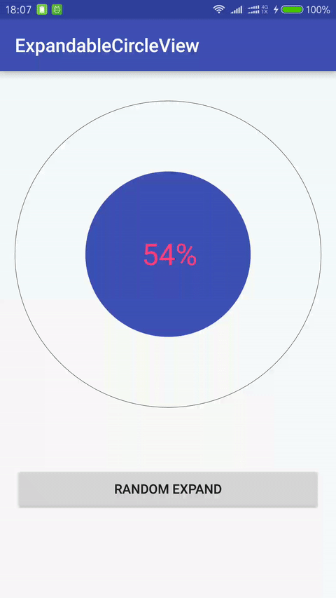

# ExpandableCircleView

[](https://android-arsenal.com/api?level=16)

A circular progress indicator that expands or shrinks the inner circle to the given progress.




## Gradle

```
dependencies {
    compile 'com.nex3z:expandable-circle-view:0.1.2'
}
```


## Usage

```xml
<com.nex3z.expandablecircleview.ExpandableCircleView
    android:id="@+id/circle"
    android:layout_width="match_parent"
    android:layout_height="wrap_content"
    app:innerColor="@color/colorPrimary"
    app:showProgressText="true"
    app:progressTextColor="@color/colorAccent"
    app:progressTextSize="32sp"/>
```

Use `setProgress(int progress)` or `setProgress(int progress, boolean animate)` to expand the inner circle according to the specified progress.

```java
mCircle = (ExpandableCircleView) findViewById(R.id.circle);
mCircle.setProgress(50, true);
```


## Customization

The `ExpandableCircleView` can be customized with the following attributes.

| Attribute                   | Format    | Description                                                                       |
|-----------------------------|-----------|-----------------------------------------------------------------------------------|
| app:innerColor              | color     | The color of inner circle.                                                        |
| app:outerColor              | color     | The color of outer circle.                                                        |
| app:max                     | integer   | The upper limit of this progress bar's range.                                     |
| app:showProgressText        | boolean   | Whether the progress text is shown in the center of the circle. Default is false. |
| app:progressTextSize        | dimension | The size of progress text.                                                        |
| app:progressTextColor       | color     | The color of progress text.                                                       |
| app:progressTextSuffix      | string    | The suffix string to be appended to the progress text.                            |
| app:expandAnimationDuration | integer   | The animation duration in millisecond for the inner circle to expand.             |
