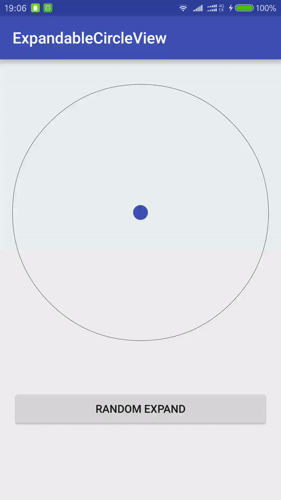

# ExpandableCircleView

A circle that can expand or shrink with animation effects. 




## Gradle

```
dependencies {
    compile 'com.nex3z:expandable-circle-view:0.1.1'
}
```


## Usage

```xml
    <com.nex3z.expandablecircleview.ExpandableCircleView
        android:layout_width="match_parent"
        android:layout_height="wrap_content"
        app:innerColor="@color/colorPrimary"
        app:expandAnimationDuration="500"/>
```

Use `expand(float proportion)` to expand the inner circle to the specific proportion (from 0 to 1).

```java
mCircle = (ExpandableCircleView) findViewById(R.id.circle);
mCircle.expand(0.6f);
```
